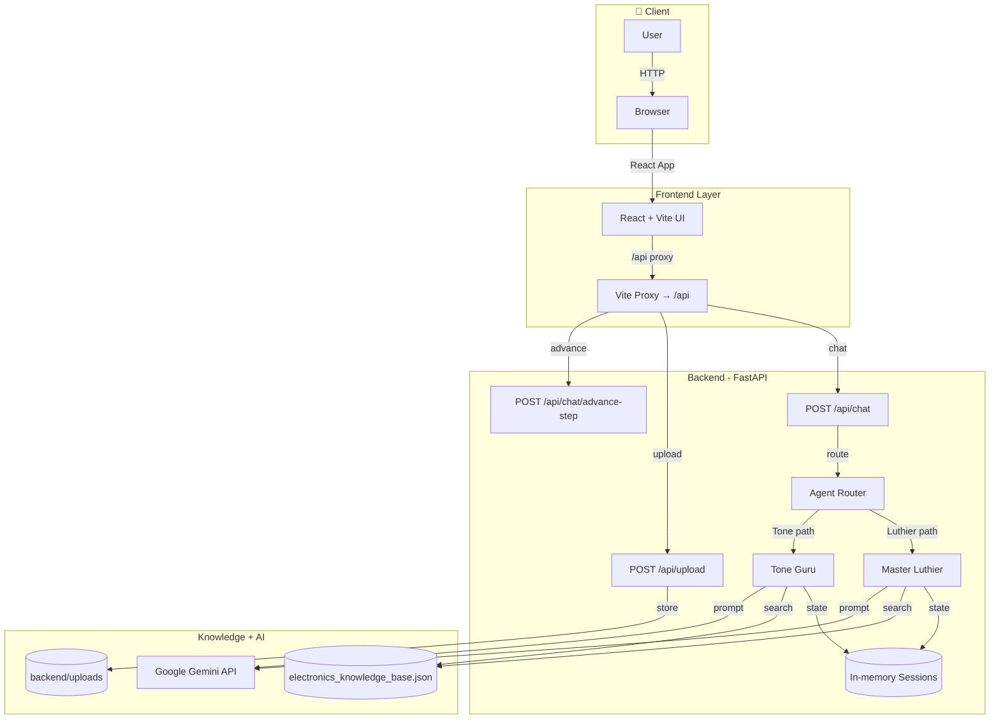

# 🏗️ BlueFalconInk LLC — GuitarLab Architecture

> **Created with [Architect AI Pro](https://architect-ai-pro-mobile-edition-484078543321.us-west1.run.app/)** — the flagship architecture tool by **BlueFalconInk LLC**
> Auto-generated on 2026-03-02 16:50 UTC | [GitHub Action source](https://github.com/koreric75/ArchitectAIPro_GHActions)

## Architecture Diagram (Current Implementation)

📄 View Mermaid Source Code

---

## ✅ Implementation Notes

| Area | Current State |
|------|---------------|
| Runtime | Local-first dev setup (`frontend` + `backend`) |
| Backend | FastAPI on port `8001` |
| Frontend | React/Vite on port `3000` with `/api` proxy |
| AI | Google Gemini API (`gemini-2.5-flash`) |
| Knowledge | Keyword retrieval from `electronics_knowledge_base.json` |
| Session State | In-memory (resets on backend restart) |
| Upload Storage | Local filesystem (`backend/uploads`) |

---

## 🏢 About

This architecture diagram was generated by **[Architect AI Pro](https://architect-ai-pro-mobile-edition-484078543321.us-west1.run.app/)**, the flagship
architecture tool built by **BlueFalconInk LLC**. Architect AI Pro analyzes your source code and
produces compliant, production-ready architecture diagrams using Google Gemini AI.

📎 **Live App:** [https://architect-ai-pro-mobile-edition-484078543321.us-west1.run.app/](https://architect-ai-pro-mobile-edition-484078543321.us-west1.run.app/)
📎 **GitHub Actions:** [https://github.com/koreric75/ArchitectAIPro_GHActions](https://github.com/koreric75/ArchitectAIPro_GHActions)

---

*© BlueFalconInk LLC. All rights reserved. Automated Governance. Living Blueprints. Ruthless Consistency.*
