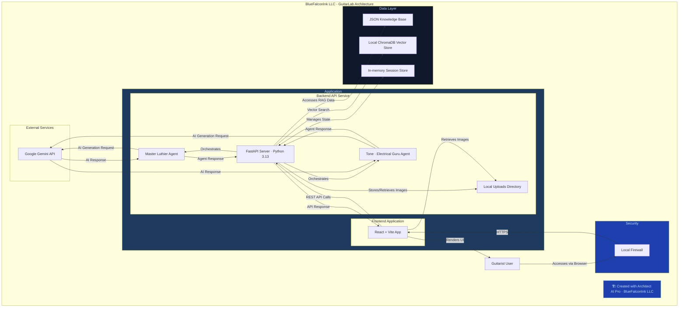

# 🏗️ BlueFalconInk LLC — GuitarLab Architecture

> **Created with [Architect AI Pro](https://architect-ai-pro-mobile-edition-484078543321.us-west1.run.app/)** — the flagship architecture tool by **BlueFalconInk LLC**
> Auto-generated on 2026-03-02 19:48 UTC | [GitHub Action source](https://github.com/koreric75/ArchitectAIPro_GHActions)

## Architecture Diagram

📄 View Mermaid Source Code

---

## 📋 BlueFalconInk LLC Building Code Compliance

| Standard | Requirement | Status |
|----------|-------------|--------|
| Cloud Provider | Local / Self-Hosted | ✅ Enforced |
| IaC | None | ✅ Enforced |
| Orchestration | None | ✅ Enforced |
| API Standard | REST | ✅ Enforced |
| Security Boundary | Required | ✅ Enforced |
| Cloud Armor / LB for Public | Required | ✅ Enforced |
| Brand Identity | BlueFalconInk LLC | ✅ Enforced |

---

## 🏢 About

This architecture diagram was generated by **[Architect AI Pro](https://architect-ai-pro-mobile-edition-484078543321.us-west1.run.app/)**, the flagship
architecture tool built by **BlueFalconInk LLC**. Architect AI Pro analyzes your source code and
produces compliant, production-ready architecture diagrams using Google Gemini AI.

📎 **Live App:** [https://architect-ai-pro-mobile-edition-484078543321.us-west1.run.app/](https://architect-ai-pro-mobile-edition-484078543321.us-west1.run.app/)
📎 **GitHub Actions:** [https://github.com/koreric75/ArchitectAIPro_GHActions](https://github.com/koreric75/ArchitectAIPro_GHActions)

---

*© BlueFalconInk LLC. All rights reserved. Automated Governance. Living Blueprints. Ruthless Consistency.*
